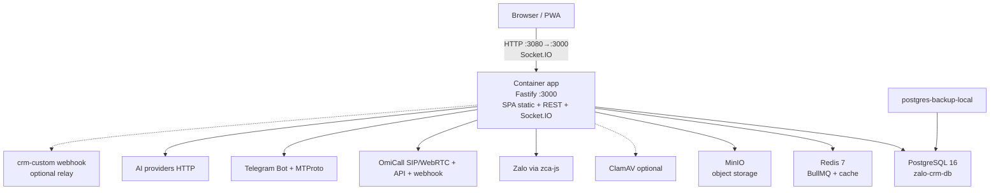

# 00 — System Overview

**Repo:** `zalo-crm-solar` (fork/branding Phúc Thịnh Solar của ZaloCRM v3.4).  
**Phạm vi scan:** working tree tại `d:\IT\zalo-crm-solar`, ngày **2026-08-20**.  
**Branch đang checkout:** `fix/omicall-sip-call-history` (commit `11196b2`).  
**Quy ước độ tin cậy:** `VERIFIED` / `INFERRED` / `UNKNOWN`.

Tài liệu này **không** chứa secret. Không copy giá trị thật từ `.env`.

---

## Project là gì? `VERIFIED`

Hệ thống **CRM quản lý nhiều nick Zalo cá nhân** trên một web app: chat realtime, khách hàng (Contact/Friend), lịch hẹn, RBAC, media, AI, softphone OmiCall, cầu Telegram.

- Tên package backend: `zalo-sales-crm-backend` **3.4.0** (`backend/package.json`).
- Frontend: `frontend` **3.4.0** (`frontend/package.json`).
- License gốc: AGPL-3.0 (README + header file). Upstream công khai: `github.com/locphamnguyen/ZaloCRM`.
- Remote của repo này: `https://github.com/phucthinhsolardeveloper-glitch/zalo-crm-solar.git`.

**Open-core:** Community edition khi không có `backend/src/_ee`. Scan ngày 20/08: **`backend/src/_ee` không tồn tại** → loader trong `app.ts` log `"Community edition — _ee bundle absent"`. Frontend alias `@ee` trỏ `frontend/src/_ee-stubs`. Lead Pool / Facebook Ads / Automation engine đầy đủ **không được register** ở edition này (comment trong `app.ts`).

---

## Kiến trúc runtime thực tế `VERIFIED`

Production Docker (`docker-compose.yml` + `docker/Dockerfile`): **một container `app`** phục vụ cả SPA đã build **và** API Fastify.



**Local Vite (không phải compose prod):** frontend `:5173` proxy `/api` và `/socket.io` → `VITE_BACKEND_URL` mặc định `http://localhost:3000` (`frontend/vite.config.ts`). Compose **dev** chỉ chạy Postgres (`docker-compose.dev.yml`).

---

## Luồng request điển hình `VERIFIED`

```text
Browser (Vue 3)
  → axios baseURL /api/v1  (frontend/src/api/index.ts)
  → Authorization: Bearer <access JWT>
  → Fastify routes (backend/src/app.ts register *)
  → authMiddleware / requireGrant / requireZaloAccess
  → Prisma client + adapter-pg (backend/src/shared/database/prisma-client.ts)
  → PostgreSQL
  → JSON response
  → UI / Pinia / composable
```

Realtime song song: Socket.IO server gắn Fastify (`app.ts`); client `frontend/src/api/socket.ts` + composable chat.

---

## Thành phần chính

| Lớp | Công nghệ | Entry | Status |
|---|---|---|---|
| Frontend | Vue 3, Vite 8, Pinia, Vue Router, Vuetify 4, Axios, Socket.IO client | `frontend/src/main.ts` | VERIFIED |
| Backend | Node ESM, Fastify 5, Prisma 7, Socket.IO, BullMQ, zca-js | `backend/src/app.ts` | VERIFIED |
| DB | PostgreSQL 16 | service `db`, volume `pg_data` | VERIFIED |
| Cache/queue | Redis 7 AOF | service `redis`, volume `redis_data` | VERIFIED |
| Files | local volume **hoặc** R2/S3; MinIO vẫn có trong compose | `STORAGE_DRIVER` + `file_storage` | VERIFIED |
| Process model | **Không** tách worker container; cron/BullMQ chạy **trong cùng process app** | `app.ts` sau `listen()` | VERIFIED |

---

## Domain model cốt lõi `VERIFIED`

Mô hình **hai cuốn sổ** (đúng schema, không chỉ docs cũ):

- **`Contact`** — khách hàng CRM (KH cha khi `mergedInto IS NULL`). Aggregate score/status/phone.
- **`Friend`** — cặp `(zaloAccount × identity)`: trạng thái bạn bè, alias, score per-nick.
- **`ZaloAccount`** — nick Zalo đã QR login; session trong `sessionData`.
- **`Conversation` / `Message`** — hội thoại + tin (soft-delete conversation qua `deletedAt`).
- **`User` + `PermissionGroup` + `Department`** — identity + RBAC.
- **`TelephonyCall`** — CDR softphone (OmiCall, mặc định `provider=omicall`).

---

## Những gì **không** có trong repo này `VERIFIED`

| Mục | Bằng chứng |
|---|---|
| Thư mục `.github/` (Actions) | glob 0 file |
| `docker-compose.montgomery.yml` | glob chỉ có `docker-compose.yml` + `docker-compose.dev.yml`; `.env.example` **có nhắc** file này → **cấu hình Montgomery không có trong repo này** (`UNKNOWN` runtime Montgomery) |
| Extension `_ee` | `Test-Path backend\src\_ee` = False |
| NestJS / Next.js | Đây là Fastify + Vue, không phải `crm-custom` |

---

## Tài liệu cũ cần đối chiếu

`docs/architecture/README.md` (2026-06-16) ghi **23 module backend, 25 views, 93 Prisma model**. Scan 2026-08-20:

- Backend `src/modules/*`: **27 thư mục** (thêm `telephony`, `devices`, `lists`, `media`, `push`, `config`, …).
- Prisma: **112** `model` (`schema.prisma`).
- Frontend views: nhiều hơn 25 (settings/reports/marketing nested).

→ README sơ đồ cũ là **lỗi thời**; lấy numbered docs này làm nguồn sự thật, diagrams PNG cũ chỉ tham khảo lịch sử.

---

## Working tree vs Git `VERIFIED`

Ngoài commit `11196b2`, working tree **chưa commit** (6 file): telephony history sync, user OmiCall auto-provision API/UI, axios 5xx toast skip, CHANGELOG. Xem `14-GIT-BRANCHES.md`.
