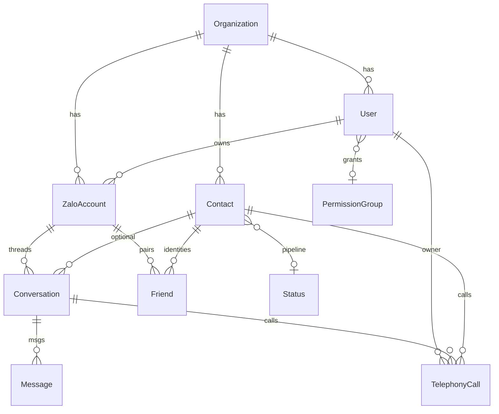

# 06 — Database

**Engine:** PostgreSQL 16 (`postgres:16-alpine`).  
**ORM:** Prisma 7 + `@prisma/adapter-pg`.  
**Schema file:** `backend/prisma/schema.prisma`.  
**Models:** **112** (`^model `).  
**Migrations:** **114** thư mục dưới `backend/prisma/migrations/`.  
**Timezone data:** Postgres `timezone=UTC` (compose command) — Prisma timestamp UTC. Log `log_timezone=Asia/Ho_Chi_Minh`. Org field `Organization.timezone` default `+07:00`.

---

## Kết nối `VERIFIED`

- Compose prod: `DATABASE_URL=postgresql://$DB_USER:$DB_PASSWORD@db:5432/$DB_NAME` **override** trong `environment` service `app` (host `db`).
- Port host: `127.0.0.1:${DB_PORT:-5433}:5432` — **không** public 0.0.0.0.
- Volume: `pg_data` → `/var/lib/postgresql/data`.
- Dev compose: volume **khác** `pg_data_dev`, password hardcode `devpassword` (chỉ local).

Client: `prisma-client.ts` **throw** nếu thiếu `DATABASE_URL`.

---

## Multi-tenant `VERIFIED`

Hầu hết bảng có `orgId` → `Organization`.  
`TENANT_GUARD_MODE` = off|warn|enforce (`config`).  
`RLS_SET_CONFIG` default false; SQL trong `backend/prisma/rls/`.  
`RefreshToken` **không** có `org_id` (comment schema: lookup pre-auth).

---

## Soft delete / audit `VERIFIED`

| Pattern | Model / field |
|---|---|
| Soft hide nick | `ZaloAccount.archivedAt` |
| Soft hide conversation | `Conversation.deletedAt` |
| Message deleted | `Message.isDeleted`, `deletedAt` |
| Contact merge hide | `Contact.mergedInto` |
| Media trash | MediaAsset trashed fields (migration `media_trashed_by`) |
| createdAt/updatedAt | Nhiều model Prisma `@default(now())` `@updatedAt` |
| Activity | `ActivityLog` |

Hard delete: `DELETE /contacts/:id` và user delete — **có route**; cascade theo FK Prisma (`onDelete: Cascade` org→children).

---

## ERD rút gọn (thực tế schema) `VERIFIED`



**Contact vs Friend:** 1 Contact → N Friend (`Friend.contactId`). Unique pair nick×uid: `Friend @@unique([zaloAccountId, zaloUidInNick])`.

**TelephonyCall:** unique `(ownerUserId, providerCallId)`; indexes org+owner+startedAt, contact, conversation.

---

## Indexes / constraints `VERIFIED` (mẫu)

- `User.email` unique nullable; `User.phone` unique.
- `Conversation` unique `(zaloAccountId, externalThreadId)`.
- `RefreshToken.tokenHash` unique.
- Contact `phoneNormalized` indexed (comment schema).

Không dump hết `@@index` (schema > 4000 dòng). Khi thêm field: đọc model + tạo migration.

---

## Migration flow `VERIFIED`

```text
Dev (thường):
  cd backend
  npx prisma migrate dev     # script db:migrate
  # hoặc db:push (nguy hiểm prod)

Prod / Docker:
  docker exec zalo-crm-app npx prisma migrate deploy
  (zalocrm-deploy.sh migrate())
```

Dockerfile **cố ý không** `prisma db push --accept-data-loss` lúc start.

Seed: `package.json` `"seed": "tsx prisma/seed.ts"` — **VERIFIED absent** (`backend/prisma/seed.ts` không tồn tại). Thư mục `prisma/seeds/` có thể chứa snippet; script `db:seed` sẽ fail cho đến khi có file.

---

## Nếu thêm/sửa/xóa field hoặc table `VERIFIED` checklist

1. Sửa `backend/prisma/schema.prisma`.
2. Tạo migration (`migrate dev`) — **không** chỉ sửa DB tay.
3. Cập nhật write path Prisma (route/service); nhớ extension auto-derive nếu field là `phone`/`fullName`/`crmName`.
4. Nếu API trả field → frontend type + form + list column.
5. Nếu filter/search → index + query `where`.
6. Tests backend liên quan.
7. Rebuild image **không** đổi data; **migrate deploy** mới đổi schema trên volume `pg_data`.
8. EE/_ee nếu field chỉ dùng automation — Community có thể không có UI.

Xem thêm `15-CHANGE-IMPACT.md`.

---

## UNKNOWN

- Có/không seed mặc định Status/PermissionGroup lúc setup ngoài `seedScoringDefaults` (auth-routes auto-seed scoring).
- RLS đã apply trên DB production Phúc Thịnh hay chưa (`RLS_SET_CONFIG` default false).
