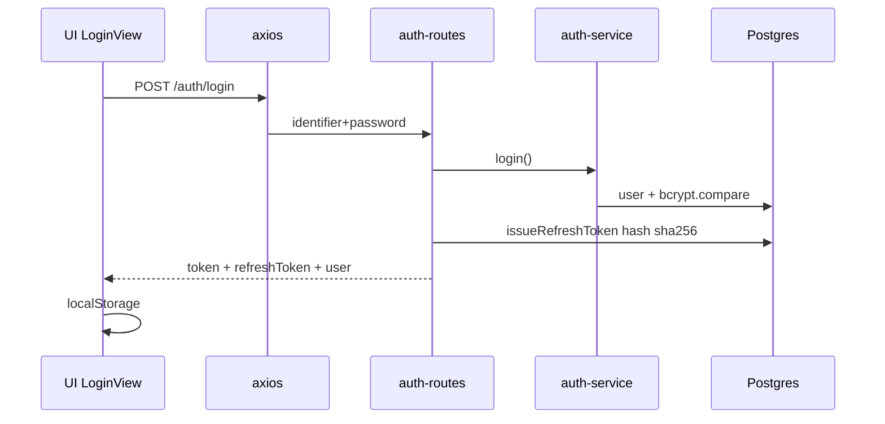
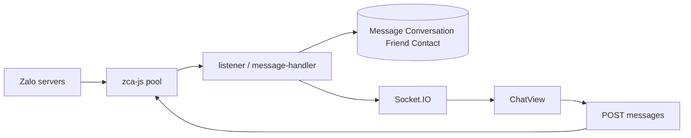
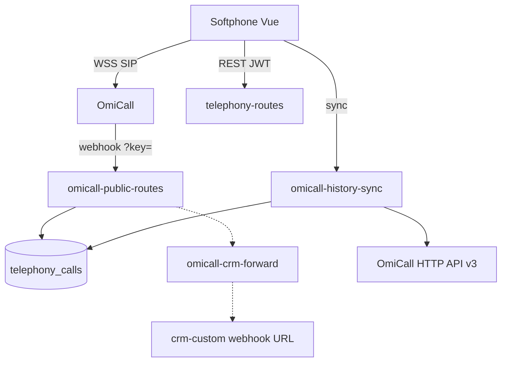

# 07 — CRUD & Business Flows

File + function **thực tế**. Không bịa repository class (project không dùng pattern đó).

---

## Contact

### CREATE

```text
UI: ContactsView / quick-create
  → use-contacts.ts create() → api.post('/contacts', payload)
  → contact-routes.ts POST /api/v1/contacts  (app.post ~line 525)
  → prisma.contact.create (orgId từ JWT)
  → prisma-client extension: phoneNormalized, name no-accent
  → logActivity / emitWebhook (import trong file)
  → JSON contact
  → list FE refresh
```

Cũng: `POST /contacts/quick-create` (~652).

### READ

```text
use-contacts fetchList → GET /contacts  requireGrant('contact','access')
  → getContactScope() lọc ID theo primary/collaborator / manager
  → where mergedInto: null
use-contacts fetchOne → GET /contacts/:id
```

### UPDATE

```text
use-contacts update → PUT /contacts/:id (~989)
  → assertContactEditable / assertContactVisible
  → prisma.contact.update
```

### DELETE

```text
use-contacts remove → DELETE /contacts/:id (~1419)
  → grant delete
  → prisma delete (cascade quan hệ theo schema)
```

---

## Conversation / Message

### CREATE message (outbound)

```text
use-chat send
  → POST /conversations/:id/messages  requireZaloAccess('chat')
  → chat-routes.ts (~1504)
  → nếu isVirtual: lưu Message local + AI virtual optional
  → else zaloPool / zaloOps gửi Zalo
  → prisma.message.create
  → applyContactAggregateFromMessage / applyFriendAggregate
  → emitChatMessage (Socket.IO)
```

### READ

```text
GET /conversations  requireGrant conversation access
GET /conversations/:id/messages
```

### UPDATE

Ít REST edit (zca-js không edit native — comment schema). `PATCH /conversations/:id/tab`. Soft delete conversation.

### DELETE

`DELETE /conversations/:id` set `deletedAt`; `POST .../restore`.

Inbound: Zalo listener (`zalo-listener-factory` / message handlers) → DB → socket — **không** đi qua POST messages của sale.

---

## User

```text
CREATE: POST /api/v1/users → user-routes.ts bcrypt.hash cost 10
READ:   GET /api/v1/users, GET /profile, GET /rbac/users
UPDATE: PUT /api/v1/users/:id
DELETE: DELETE /api/v1/users/:id
```

Setup owner: `auth-service.setup` bcrypt **12**.

---

## TelephonyCall

```text
CREATE local: POST /telephony/calls → telephony-routes.ts prisma.telephonyCall.create
CREATE/upsert webhook: POST /telephony/omicall/events → omicall-public-routes
CREATE/upsert sync: POST /telephony/omicall/sync → omicall-history-sync.ts
READ: GET /telephony/calls (scope owner)
UPDATE: PATCH /telephony/calls/:id (status, duration, …)
DELETE: không thấy route DELETE calls  → UNKNOWN xóa CDR từ UI
```

---

## Friend

Chủ yếu sync từ Zalo (`friend-sync-service`, cron, events) + `friend-routes.ts` (accept/reject/block/alias). FE: `use-friends.ts`.

---

## Business flows (module tồn tại)

### 1. Đăng nhập



### 2. Chat Zalo realtime



### 3. OmiCall



### 4. Privacy nick main

Sale OTP Zalo → `privacy-routes` → session `UserPrivacySession` → redact middleware `privacy/redact` trên nội dung chat.

### 5. Telegram bridge (nếu env bot token)

Zalo message → bridge-bus → Telegram topic; reply Telegram → Zalo. Config `TelegramBridgeConfig`. Init `initTelegramBridge()` trong `app.ts`.

### 6. Lead Pool / Facebook Ads

**Không mount** Community (không `_ee`). Model Prisma **vẫn có** (LeadRequest, Facebook*). UI EE stub rỗng.

---

## UNKNOWN

- Có UI xóa `TelephonyCall` hay chỉ append.
- Mọi nhánh error Zalo send (rate limit) — có `zalo-rate-limiter.ts`.
