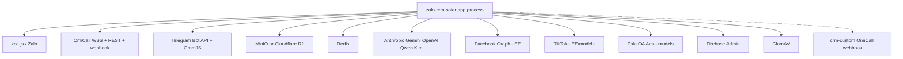

# 09 — External Integrations

Chỉ integration **có code**. Không bịa SIP server nội bộ ngoài OmiCall.

---

## Bản đồ



---

## Zalo `VERIFIED`

- Lib: `zca-js`.
- Pool: `backend/src/modules/zalo/zalo-pool.ts`.
- Session: `ZaloAccount.sessionData` JSON (cookie, imei, userAgent).
- QR login + reconnect boot `app.ts`.
- Proxy per-account `proxyUrl`.
- Rate limit: `zalo-rate-limiter.ts`, `SdkLimit` model.
- **Không** phải Zalo Official Account làm kênh chat chính — nick **cá nhân**.
- ZCC OmiCall: gọi **SĐT khách** qua OA công ty, comment config: không gọi UID chat.

---

## OmiCall `VERIFIED`

Env: `OMICALL_ENABLED`, `OMICALL_DOMAIN`, `OMICALL_WSS_URI`, outbound mode/hotline, ZCC flags, `OMICALL_WEBHOOK_SECRET`, `OMICALL_API_KEY`, `OMICALL_API_BASE_URL`.

```text
CRM UI
  → GET connect-config (sipUser + decrypted sipPassword)
  → Browser SIP.js/WebRTC → OMICALL_WSS_URI
OmiCall
  → POST /api/v1/telephony/omicall/events?key=
  → upsert TelephonyCall
  → optional omicall-crm-forward.ts → CRM_CUSTOM_OMICALL_WEBHOOK_URL
CRM
  → POST /telephony/omicall/sync → API v3 history/recordings
```

Recording mirror: `omicall-recording.ts` (tests tồn tại).  
Provisioning: `omicall-agent-provisioning.ts`, `omicall-directory.ts`.

**SIP media không đi Docker app** — browser ↔ OmiCall.

---

## Telegram bridge `VERIFIED`

Env `TELEGRAM_BRIDGE_BOT_TOKEN`, username, provisioner API ID/hash/session.  
Routes `/api/v1/telegram-bridge/*`. Docs: `docs/HUONG-DAN-CAU-HINH-TELEGRAM-BRIDGE.md`.  
Tắt khi thiếu token (comment .env.example).

---

## Object storage `VERIFIED`

`STORAGE_DRIVER=local|r2`. Local: volume `file_storage` + `/files/`. R2: AWS SDK, docs `HUONG-DAN-CAU-HINH-CLOUDFLARE-R2.md`.  
MinIO trong compose: dùng khi S3_* trỏ `http://minio:9000`. Compose **không** còn override STORAGE bằng MINIO_ROOT (comment 2026-06-20).

---

## Redis `VERIFIED`

`REDIS_URL` default `redis://redis:6379`. BullMQ group-scan, event-buffer, dirty tags, AOF persist jobs.

---

## AI `VERIFIED`

`ai-routes.ts` + `AiConfig` per org. Providers env Anthropic/Gemini/OpenAI/Qwen/Kimi. Chatbot RAG: `AiKnowledgeDoc/Chunk`, migration `20260723060000_ai_zalo_chatbot_rag`.

---

## Webhooks outbound `VERIFIED`

`modules/api/webhook-settings-routes.ts` + `emitWebhook` từ contact-routes. Settings UI `/settings/dev/api`.

---

## Facebook / TikTok / Zalo Ads `VERIFIED` schema + `INFERRED` runtime

Model Prisma đầy đủ. Routes Graph **comment EE**. Community: **không** `registerExtensionRoutes` → UI/API Lead Ads **không mount**. Env `FB_*` / `TIKTOK_*` / `ZALO_OA_*` vẫn có trong `.env.example`.

---

## Firebase push `VERIFIED` code, `UNKNOWN` prod

`firebase-admin`, `Device` model, `modules/push`. `.env.example` nói montgomery compose **không có trong repo này**.

---

## ClamAV `VERIFIED`

Optional `MEDIA_AV_ENABLED`. Fail-open default.

---

## crm-custom relay `VERIFIED` code

`config.crmCustomOmicallWebhookUrl` + secret. File `omicall-crm-forward.ts`. Empty URL = disable.

---

## Stringee `VERIFIED` di sản

Migration `20260724050000_stringee_telephony`; FE `stringee-web.d.ts`. Telephony **default provider omicall**. Stringee không còn là đường chính (`INFERRED` từ default schema + OmiCall module).
