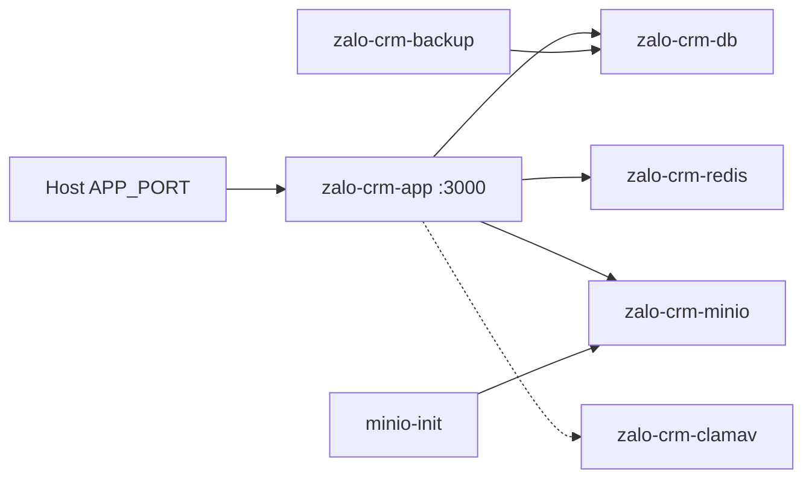

# 10 — Docker

Files: `docker-compose.yml`, `docker-compose.dev.yml`, `docker/Dockerfile`. **Không** có compose production tách file thứ hai trong repo.

---

## Images & containers `VERIFIED`

| Service | Image / build | Container name | Ports (host→ctr) |
|---|---|---|---|
| app | build `docker/Dockerfile` | `zalo-crm-app` | `${APP_PORT:-3080}:3000` |
| db | postgres:16-alpine | `zalo-crm-db` | `127.0.0.1:${DB_PORT:-5433}:5432` |
| redis | redis:7-alpine | `zalo-crm-redis` | `127.0.0.1:${REDIS_PORT:-6379}:6379` |
| minio | minio/minio:latest | `zalo-crm-minio` | `${MINIO_PORT:-9000}:9000`, console `127.0.0.1:9001` |
| minio-init | minio/mc:latest | `zalo-crm-minio-init` | one-shot |
| backup | prodrigestivill/postgres-backup-local | `zalo-crm-backup` | none; volume `./backups` |
| clamav | clamav/clamav:1.4 | `zalo-crm-clamav` | **không** publish host |

Network: default compose network (tên project). App `depends_on` db/minio/redis **healthy**. **Không** depends_on clamav.

---

## Volumes `VERIFIED`

| Volume | Mount | Mất khi `down -v`? |
|---|---|---|
| `pg_data` | Postgres data | **Có** |
| `redis_data` | Redis AOF | **Có** |
| `minio_data` | MinIO objects | **Có** |
| `file_storage` | `/var/lib/zalo-crm/files` | **Có** |
| `clamav_data` | virus DB | **Có** |
| bind `./backups` | backup files trên host | **Không** (thư mục host) |

---

## App image `VERIFIED`

Multi-stage:

1. `frontend-builder`: `npm ci --legacy-peer-deps`, `npm run build`
2. `backend-builder`: alpine vips-dev, `npm install` (**không** `npm ci`, comment lock drift), `prisma generate`, `tsc`
3. Runtime: tini, ffmpeg, tzdata, vips; copy `dist`, `node_modules`, `prisma`, `scripts`, FE `static`

- `EXPOSE 3000`
- `ENTRYPOINT tini`
- `CMD node dist/app.js`
- `NODE_ENV=production` từ compose environment
- tmpfs `/tmp`; `no-new-privileges`

**Không bind-mount source** vào `app` → sửa code host **không** vào container cho đến rebuild.

---

## Healthchecks `VERIFIED`

- db: `pg_isready`
- redis: `redis-cli ping`
- minio: curl live
- clamav: `clamdcheck.sh` start_period 300s
- **app:** không healthcheck compose; probe HTTP `/health` trong process

---

## Dev compose `VERIFIED`

Chỉ `db` `zalo-crm-db-dev`, port **5433:5432**, user `crmuser` / `devpassword` / db `zalocrm`. Volume `pg_data_dev` **tách** prod.

---

## Diagram

---

## Env trong compose `VERIFIED`

`env_file: .env` + override `DATABASE_URL` host `db`, `REDIS_URL` default redis, `AUTOMATION_STUB_MODE`, `FRIEND_INVITE_TEST_MODE` **default true** (compose) — **ảnh hưởng automation test timing** nếu EE bật.

MinIO user/password **bắt buộc** interpolation `:?must be set`.
